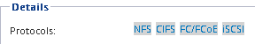

= 在现有 SVM 上配置 FC
:allow-uri-read: 
:icons: font
:imagesdir: ../media/

[role="lead"]
您可以在现有 Storage Virtual Machine （ SVM ）上配置 FC 。必须已在 SVM 上启用 FC 协议，但尚未配置该协议。此信息适用于要为其配置多个协议但尚未配置 FC 的 SVM 。

.开始之前
必须配置 FC 网络结构，并且必须将所需的物理端口连接到该网络结构。

.步骤
. 导航到 * SVM* 窗口。
. 选择要配置的 SVM 。
. 在 SVM* 详细信息 * 窗格中，验证 * FC/FCoE* 是否以灰色背景显示，这表示协议已启用，但尚未完全配置。
+
如果 * FC/FCoE* 以绿色背景显示，则表示 SVM 已配置。

+

. 单击带有灰色背景的 * FC/FCoE* 协议链接。
+
此时将显示配置 FC/FCoE 协议窗口。

. 从 * 配置 FC/FCoE 协议 * 页面配置 FC 服务和 LIF ：
+
.. 选中 * 为 FC* 配置数据 LIF 复选框。
.. 输入 ... `2` 在*每个节点的Lifs数*字段中。
+
每个节点需要两个 LIF ，以确保可用性和数据移动性。

.. 忽略可选的 * 为 FCP 存储配置 LUN * 区域，因为稍后可通过适用于 VMware vSphere 的 Virtual Storage Console 配置 LUN 。
.. 单击 * 提交并关闭 * 。

. 查看 * 摘要 * 页面，记录 LIF 信息，然后单击 * 确定 * 。

