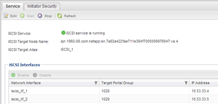

= 验证 iSCSI 服务是否正在现有 SVM 上运行
:allow-uri-read: 
:icons: font
:imagesdir: ../media/

[role="lead"]
如果选择使用现有 Storage Virtual Machine （ SVM ），则必须验证此 SVM 上是否正在运行 iSCSI 服务。

.开始之前
您必须已选择要在其上创建新 LUN 的现有 SVM 。

.步骤
. 导航到 * SVM* 窗口。
. 单击 * SVM 设置 * 选项卡。
. 在 * 协议 * 窗格中，单击 * iSCSI * 。
. 验证 iSCSI 服务是否正在运行。
+

. 记录为 SVM 列出的 iSCSI 接口。

== 下一步操作

如果 iSCSI 服务未运行，请启动 iSCSI 服务或创建新的 SVM 。

如果每个节点的 iSCSI 接口数少于两个，请更新 SVM 上的 iSCSI 配置或为 iSCSI 创建新的 SVM 。
