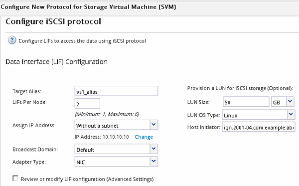

= 在现有 SVM 上配置 iSCSI
:allow-uri-read: 
:icons: font
:imagesdir: ../media/

[role="lead"]
您可以在现有 Storage Virtual Machine （ SVM ）上配置 iSCSI ，并使用一个向导创建 LUN 及其所在的卷。iSCSI 协议必须已在 SVM 上启用，但尚未配置。此信息适用于要为其配置多个协议但尚未配置 iSCSI 的 SVM 。

.开始之前
您必须具有足够的可用网络地址，以便为每个节点创建两个 LIF 。

.关于此任务
LUN 会映射到 igroup 中的一部分启动程序，以限制从主机到 LUN 的路径数。

* ONTAP 使用选择性 LUN 映射（ Selective LUN Map ， SLM ）使 LUN 只能通过 LUN 所属节点及其 HA 配对节点上的路径进行访问。
* 您仍然必须在每个节点上配置所有 iSCSI LIF ，以实现 LUN 移动性，以防 LUN 移动到集群中的另一个节点。
* 在移动卷或 LUN 之前，必须修改 SLM 报告节点列表。

.步骤
. 导航到 * SVM* 窗口。
. 选择要配置的 SVM 。
. 在 SVM* 详细信息 * 窗格中，验证 * iSCSI * 是否以灰色背景显示，这表示协议已启用，但尚未完全配置。
+
如果 * iSCSI * 以绿色背景显示，则表示 SVM 已配置。

+
image::../media/existing_svm_protocols_iscsi_rhel.gif[图中显示了详细信息页面，其中所有四个协议的背景均为灰色。]

. 单击灰色背景的 * iSCSI* 协议链接。
+
此时将显示配置 iSCSI 协议窗口。

. 从 * 配置 iSCSI 协议 * 页面配置 iSCSI 服务和 LIF ：
+
.. *可选：*输入目标别名。
.. 输入 ... `*2*` 在*每个节点的Lifs数*字段中。
+
每个节点需要两个 LIF ，以确保可用性和数据移动性。

.. 为 LIF 分配 IP 地址，可以使用子网，也可以不使用子网。
.. 在 * 为 iSCSI 存储配置 LUN * 区域中，输入所需的 LUN 大小，主机类型和主机的 iSCSI 启动程序名称。
.. 单击 * 提交并关闭 * 。

+

. 查看 * 摘要 * 页面，记录 LIF 信息，然后单击 * 确定 * 。

