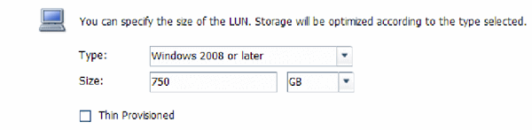

= 创建LUN
:allow-uri-read: 
:icons: font
:imagesdir: ../media/

[role="lead"]
您可以使用创建 LUN 向导创建 LUN 。此向导还会创建 igroup 并将 LUN 映射到 igroup ，从而使指定主机能够访问此 LUN 。

.开始之前
* 必须有一个具有足够可用空间的聚合来容纳 LUN 。
* 必须有一个已启用 iSCSI 协议并已创建相应逻辑接口（ LIF ）的 Storage Virtual Machine （ SVM ）。
* 您必须已记录主机的 iSCSI 启动程序节点名称。

LUN 会映射到 igroup 中的一部分启动程序，以限制从主机到 LUN 的路径数。

* 默认情况下， ONTAP 使用选择性 LUN 映射（ Selective LUN Map ， SLM ）使 LUN 只能通过 LUN 所属节点及其高可用性（ HA ）配对节点上的路径进行访问。
* 您仍然必须在每个节点上配置所有 iSCSI LIF ，以实现 LUN 移动性，以防 LUN 移动到集群中的另一个节点。
* 移动卷或 LUN 时，必须在移动之前修改 SLM 报告节点列表。

.关于此任务
如果您的组织具有命名约定，则应根据您的约定为 LUN ，卷等使用名称。否则，您应接受默认名称。

.步骤
. 导航到 * LUN * 窗口。
. 单击 * 创建。 *
. 浏览并选择要在其中创建 LUN 的 SVM 。
+
此时将显示创建 LUN 向导。

. 在 * 常规属性 * 页面上，为 Windows 主机直接使用的 LUN 选择 LUN 类型 * Windows 2008 或更高版本 * ，或者为包含 Hyper-V 虚拟机虚拟硬盘（ VHD ）的 LUN 选择 * Hyper-V * 。
+
保持未选中 * 精简配置 * 复选框。

+

. 在 * LUN Container* 页面上，选择现有的 FlexVol 卷。
+
您必须确保卷中有足够的空间。如果现有卷没有足够的可用空间，您可以创建新卷。

. 在 * 启动程序映射 * 页面上，单击 * 添加启动程序组 * ，在 * 常规 * 选项卡上输入所需信息，然后在 * 启动程序 * 选项卡上输入您记录的主机的 iSCSI 启动程序节点名称。
. 确认详细信息，然后单击 * 完成 * 完成向导。

* 相关信息 *

https://docs.netapp.com/us-en/ontap/system-admin/index.html["系统管理"]
