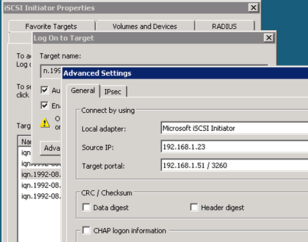

= 启动与目标的 iSCSI 会话
:allow-uri-read: 
:icons: font
:imagesdir: ../media/

[role="lead"]
Windows 主机必须与集群中的每个节点建立 iSCSI 连接。您可以使用主机上的 iSCSI 启动程序属性对话框从主机建立会话。

.开始之前
您必须知道包含要访问的 LUN 的 Storage Virtual Machine （ SVM ）上 iSCSI 数据 LIF 的 IP 地址。

.关于此任务
在 ONTAP 中， iSCSI 主机必须具有指向集群中每个节点的路径。原生 DSM 会选择要使用的最佳路径。如果路径失败，原生 DSM 将选择备用路径。

iSCSI 启动程序属性对话框中的按钮和标签因 Windows 版本而异。此任务中的某些步骤包含多个按钮或标签名称；您应选择与所使用的 Windows 版本匹配的名称。

.步骤
. 打开 * iSCSI 启动程序属性 * 对话框：
+
|===
| 针对 ... | 单击 

 a| 
Windows Server 2012
 a| 
* 服务器管理器 * > * 信息板 * > * 工具 * > * iSCSI 启动程序 *

 a| 
Windows Server 2008
 a| 
* 开始 * > * 管理工具 * > * iSCSI 启动程序 *

|===
. 在 * 发现 * 选项卡上，单击 * 发现门户 * 或 * 添加门户 * ，然后输入 iSCSI 目标端口的 IP 地址。
. 在 * 目标 * 选项卡上，选择发现的目标，然后单击 * 登录 * 或 * 连接 * 。
. 选择 * 启用多路径 * ，选择 * 计算机启动时自动还原此连接 * 或 * 将此连接添加到收藏的目标列表 * ，然后单击 * 高级 * 。
. 对于 * 本地适配器 * ，选择 * Microsoft iSCSI 启动程序 * 。
+
以下示例来自 Windows Server 2008 ：

+

. 对于 * 源 IP* 或 * 启动程序 IP* ，请选择与 iSCSI 目标 LIF 之一位于同一子网或 VLAN 上的端口的 IP 地址。
. 保留其余复选框的默认值，然后单击 * 确定 * 。
. 在 * 目标 * 选项卡上，再次选择同一个目标，然后单击 * 登录 * 或 * 连接 * 。
. 选择 * 启用多路径 * ，选择 * 计算机启动时自动还原此连接 * 或 * 将此连接添加到收藏的目标列表 * ，然后单击 * 高级 * 。
. 对于 * 源 IP* 或 * 启动程序 IP* ，请选择不同 iSCSI 目标 LIF 子网或 VLAN 上其他端口的 IP 地址。
. 对于 * 目标门户 * ，选择与您刚刚为 * 源 IP* 选择的端口对应的 iSCSI 目标 LIF 的 IP 地址。
. 保留其余复选框的默认值，然后单击 * 确定 * 。
. 重复步骤 8 到 12 以连接到可用的每个目标 LIF 。

