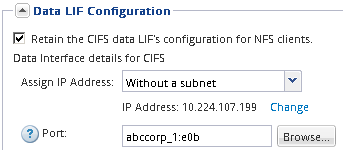

= 添加对现有 SVM 的 NFS 访问
:allow-uri-read: 
:icons: font
:imagesdir: ../media/

[role="lead"]
要向现有SVM添加NFS访问、必须先创建数据逻辑接口(LIF)。然后，您可以在 ESXi 主机上配置 NFS 访问，并使用 Virtual Storage Console 验证是否已为 ESXi 启用 NFS 。

.开始之前
* 您必须知道将使用以下哪些网络组件：
+
** 要创建数据 LIF 的节点以及该节点上的特定端口
** 要从中配置数据 LIF IP 地址的子网，或者您也可以选择要分配给数据 LIF 的特定 IP 地址

* 必须正确配置任何外部防火墙，才能访问网络服务。
* SVM 上必须允许使用 NFS 协议。
+
如果在配置其他协议时未按照此操作步骤创建 SVM ，则会出现这种情况。

.步骤
. 导航到*详细信息*窗格、在此可以配置SVM的协议：
+
.. 选择要配置的 SVM 。
.. 在 * 详细信息 * 窗格中，单击 * 协议 * 旁边的 * NFS * 。
+
image::../media/svm_add_protocol_nfs_nfs_esxi.gif[此图通过周围的文本进行了说明。]

. 在 * 配置 NFS 协议 * 对话框中，创建数据 LIF ：
+
.. 从您指定的子网自动为 LIF 分配 IP 地址，或者手动输入地址。
.. 单击 * 浏览 * 并选择要与 LIF 关联的节点和端口。
+

+
请勿输入任何信息来配置卷。您可以稍后使用 Virtual Storage Console 配置数据存储库。

. 单击 * 提交并关闭 * ，然后单击 * 确定 * 。

