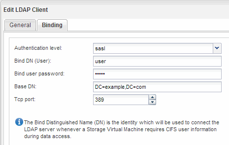

= 配置 LDAP （创建启用了 NFS 的新 SVM ）
:allow-uri-read: 
:icons: font
:imagesdir: ../media/

[role="lead"]
如果您希望 Storage Virtual Machine （ SVM ）从基于 Active Directory 的轻型目录访问协议（ LDAP ）中获取用户信息，则必须创建 LDAP 客户端，为 SVM 启用此客户端，并使 LDAP 优先于其他用户信息源。

.开始之前
* LDAP 配置必须使用 Active Directory （ AD ）。
+
如果您使用其他类型的 LDAP ，则必须使用命令行界面（ CLI ）和其他文档来配置 LDAP 。有关详细信息，请参见 link:https://docs.netapp.com/us-en/ontap/nfs-config/using-ldap-concept.html["LDAP 使用概述"^]。

* 您必须了解 AD 域和服务器以及以下绑定信息：身份验证级别，绑定用户和密码，基础 DN 和 LDAP 端口。

.步骤
. 导航到 * SVM* 窗口。
. 选择所需的 SVM
. 单击 * SVM 设置 * 选项卡。
. 设置 LDAP 客户端以供 SVM 使用：
+
.. 在 * 服务 * 窗格中，单击 * LDAP 客户端 * 。
.. 在 * LDAP 客户端配置 * 窗口中，单击 * 添加 * 。
.. 在*Create LDAP Client*窗口的*General选项卡中，键入LDAP客户端配置的名称，例如 `vs0client1`。
.. 添加 AD 域或 AD 服务器。
+
image::../media/ldap_client_creation_general_tab_nfs.gif[此图通过周围的文本进行了说明。]

.. 单击 * 绑定 * ，然后指定身份验证级别，绑定用户和密码，基本 DN 和端口。
+

.. 单击 * 保存并关闭 * 。

+
此时将创建一个新客户端，并可供 SVM 使用。

. 为 SVM 启用新的 LDAP 客户端：
+
.. 在导航窗格中，单击 * LDAP 配置 * 。
.. 单击 * 编辑 * 。
.. 确保在 * LDAP 客户端名称 * 中选择了刚刚创建的客户端。
.. 选择 * 启用 LDAP 客户端 * ，然后单击 * 确定 * 。
+
image::../media/ldap_svm_configuration_active_ldap_client_nfs.gif[此图通过周围的文本进行了说明。]

+
SVM 使用新的 LDAP 客户端。

. 使 LDAP 优先于其他用户信息源，例如网络信息服务（ NIS ）以及本地用户和组：
+
.. 导航到 * SVM* 窗口。
.. 选择 SVM 并单击 * 编辑 * 。
.. 单击 * 服务 * 选项卡。
.. 在 * 名称服务开关 * 下，指定 * LDAP * 作为数据库类型的首选名称服务开关源。
.. 单击 * 保存并关闭 * 。
+
image::../media/name_services_ldap_priority_nfs.gif[本图通过周围的文字进行了说明。]

+
LDAP 是此 SVM 上名称服务和名称映射的主要用户信息来源。

