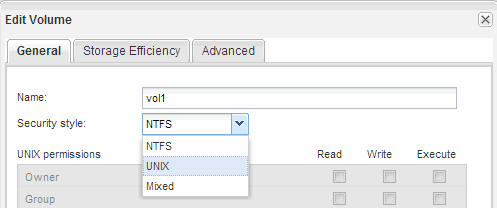

= 创建并配置卷
:allow-uri-read: 
:icons: font
:imagesdir: ../media/

[role="lead"]
您必须创建一个 FlexVol 卷以包含数据。您可以选择更改卷的默认安全模式，此模式是从根卷的安全模式继承的。您也可以选择更改卷在命名空间中的默认位置，即 Storage Virtual Machine （ SVM ）的根卷。

.步骤
. 导航到 * 卷 * 窗口。
. 单击 * 创建 * > * 创建 FlexVol * 。
+
此时将显示创建卷对话框。

. 如果要更改以日期和时间戳结尾的默认名称、请指定新名称、例如 `vol1`。
. 为卷选择一个聚合。
. 指定卷的大小。
. 单击 * 创建 * 。
+
默认情况下，在 System Manager 中创建的任何新卷都会使用卷名称作为接合名称挂载到根卷上。NFS 客户端在挂载卷时使用接合路径和接合名称。

. 如果您不希望将卷位于 SVM 的根目录，请修改新卷在现有命名空间中的位置：
+
.. 导航到 * 命名空间 * 窗口。
.. 从下拉菜单中选择 * SVM* 。
.. 单击 * 挂载 * 。
.. 在 * 挂载卷 * 对话框中，指定卷，其接合路径的名称以及要挂载卷的接合路径。
.. 在 * 命名空间 * 窗口中验证新的接合路径。
+
如果要将某些卷组织在名为 `data` 的主卷下，可以将新卷 "`vol1` " 从根卷移动到 " `data` " 卷。

+
image::../media/namespace_1_before_nfs.gif[本图通过周围的文字进行了说明。]

. 查看卷的安全模式，并根据需要进行更改：
+
.. 在 * 卷 * 窗口中，选择刚刚创建的卷，然后单击 * 编辑 * 。
+
此时将显示编辑卷对话框，其中显示了卷的当前安全模式，此安全模式是从 SVM 根卷的安全模式继承的。

.. 确保安全模式为 UNIX 。
+

