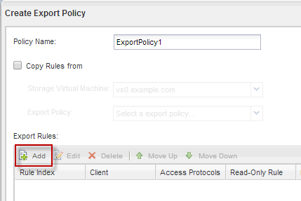

= 为卷创建导出策略
:allow-uri-read: 
:icons: font
:imagesdir: ../media/

[role="lead"]
在任何 NFS 客户端能够访问卷之前，您必须为卷创建导出策略，添加允许管理主机访问的规则，并将新导出策略应用于卷。

.步骤
. 导航到 * SVM* 窗口。
. 单击 * SVM 设置 * 选项卡。
. 创建新导出策略：
+
.. 在 * 策略 * 窗格中，单击 * 导出策略 * ，然后单击 * 创建 * 。
.. 在 * 创建导出策略 * 窗口中，指定策略名称。
.. 在 * 导出规则 * 下，单击 * 添加 * 向新策略添加规则。

+

. 在 * 创建导出规则 * 对话框中，创建一个允许管理员通过所有协议对导出进行完全访问的规则：
+
.. 指定要从中管理导出卷的 IP 地址或客户端名称，例如 admin_host 。
.. 选择*NFSv3*。
.. 确保已选择所有 * 读 / 写 * 访问详细信息以及 * 允许超级用户访问 * 。
+
image::../media/export_rule_for_admin_manual_multi_nfs.gif[上述文本对此屏幕截图进行了说明。]

.. 单击 * 确定 * ，然后单击 * 创建 * 。

+
此时将创建新导出策略及其新规则。

. 将新导出策略应用于新卷，以便管理员主机可以访问此卷：
+
.. 导航到 * 命名空间 * 窗口。
.. 选择卷并单击 * 更改导出策略 * 。
.. 选择新策略并单击 * 更改 * 。

* 相关信息 *

xref:task_verifying_nfs_access_from_unix_administration_host.adoc[验证从 UNIX 管理主机进行的 NFS 访问]
