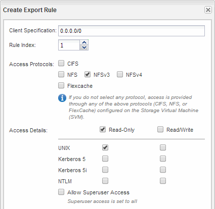

= 打开 SVM 根卷的导出策略（配置对现有 SVM 的 NFS 访问）
:allow-uri-read: 
:icons: font
:imagesdir: ../media/

[role="lead"]
您必须向默认导出策略添加一条规则，以允许所有客户端通过 NFSv3 进行访问。如果没有此规则，则会拒绝所有 NFS 客户端访问 Storage Virtual Machine （ SVM ）及其卷。

.关于此任务
您应将所有 NFS 访问指定为默认导出策略，稍后应通过为单个卷创建自定义导出策略来限制对单个卷的访问。

.步骤
. 导航到 * SVM* 窗口。
. 单击 * SVM 设置 * 选项卡。
. 在 * 策略 * 窗格中，单击 * 导出策略 * 。
. 选择名为 * 默认 * 的导出策略，该策略将应用于 SVM 根卷。
. 在下部窗格中，单击 * 添加 * 。
. 在 * 创建导出规则 * 对话框中，创建一个规则，以便为 NFS 客户端打开对所有客户端的访问：
+
.. 在“*客户端规范*”字段中，输入 `0.0.0.0/0` 以便规则适用场景所有客户端。
.. 规则索引的默认值保留为 * 1 * 。
.. 选择*NFSv3*。
.. 清除 * 只读 * 下除 * unix* 复选框以外的所有复选框。
.. 单击 * 确定 * 。

+

.结果
现在， NFSv3 客户端可以访问在 SVM 上创建的任何卷。
