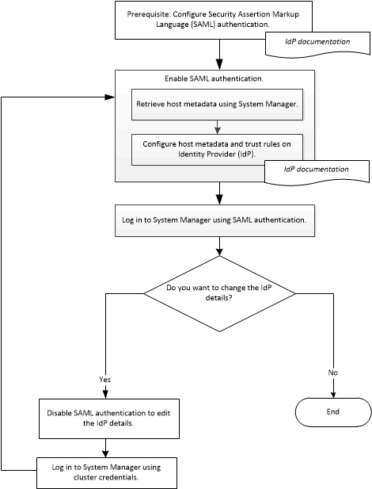

= 使用 System Manager — ONTAP 9.7 及更早版本设置 SAML 身份验证
:allow-uri-read: 
:icons: font
:imagesdir: ../media/

[role="lead"]
您可以使用ONTAP System Manager classic (适用于ONTAP 9.7及更早版本)设置安全断言标记语言(SAML)身份验证。远程用户在登录到 System Manager 之前，会通过安全身份提供程序（ IdP ）进行身份验证。

== 启用 SAML 身份验证

您可以使用 System Manager 配置安全断言标记语言（ Security Assertion Markup Language ， SAML ）身份验证，以便远程用户可以使用安全身份提供程序（ IdP ）登录。

.开始之前
* 必须配置计划用于远程身份验证的 IdP 。
+
[NOTE]
====
请参见您配置的 IdP 提供的文档。

====
* 您必须具有 IdP 的 URI 。

.关于此任务
以下IDP已通过System Manager的验证：

* Active Directory联合身份验证服务
* Cisco Duo (已通过以下ONTAP版本的验证：)
+
** 9.7P21及更高版本9.7
** 9.8P17及更高版本9.8
** 9.9.1P13及更高版本9.9
** 9.10.1P9及更高版本9.10
** 9.11.1P4及更高的9.11版本
** 9.12.1及更高版本

* Shibboleth

[NOTE]
====
启用 SAML 身份验证后，只有远程用户才能访问 System Manager 图形用户界面。启用 SAML 身份验证后，本地用户无法访问 System Manager 图形用户界面。

====
.步骤
. 单击 * 配置 * > * 集群 * > * 身份验证 * 。
. 选中 * 启用 SAML 身份验证 * 复选框。
. 将 System Manager 配置为使用 SAML 身份验证：
+
.. 输入 IdP 的 URI 。
.. 输入主机系统的 IP 地址。
.. *可选：*如果需要、请更改主机系统证书。

. 单击 * 检索主机元数据 * 以检索主机 URI 和主机元数据信息。
. 复制主机 URI 或主机元数据详细信息，访问 IdP ，然后在 IdP 窗口中指定主机 URI 或主机元数据详细信息以及信任规则。
+
[NOTE]
====
请参见您配置的 IdP 提供的文档。

====
. 单击 * 保存 * 。
+
此时将显示 IdP 登录窗口。

. 使用 IdP 登录窗口登录到 System Manager 。
+
配置 IdP 后，如果用户尝试使用完全限定域名（ FQDN ）， IPv6 或集群管理 LIF 进行登录，则系统会自动将 IP 地址更改为在 IdP 配置期间指定的主机系统的 IP 地址。

== 禁用 SAML 身份验证

如果要禁用对 System Manager 的远程访问或编辑 SAML 配置，则可以禁用安全断言标记语言（ SAML ）身份验证。

.关于此任务
禁用 SAML 身份验证不会删除 SAML 配置。

.步骤
. 单击 * 配置 * > * 集群 * > * 身份验证 * 。
. 清除 * 启用 SAML 身份验证 * 复选框。
. 单击 * 保存 * 。
+
System Manager 将重新启动。

. 使用集群凭据登录到 System Manager 。

* 相关信息 *

xref:task_accessing_cluster_by_using_system_manager_brower_based_gui.adoc[使用 ONTAP System Manager 基于浏览器的图形界面访问集群]
