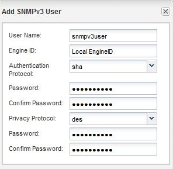

= 添加 SNMPv3 安全用户
:allow-uri-read: 
:icons: font
:imagesdir: ../media/

[role="lead"]
您可以在 ONTAP 9.7 或更早版本中使用 ONTAP System Manager _classic_ 界面在集群级别添加 SNMPv3 用户。

SNMPv3 用户可以使用您指定的身份验证和隐私设置从陷阱主机（ SNMP 管理器）运行 SNMP 实用程序。SNMPv3 通过使用密码短语和加密提供高级安全性。

.关于此任务
在集群级别添加 SNMPv3 用户时，该用户可以通过应用了 `mGMT` 防火墙策略的所有 LIF 访问集群。

.步骤
. 在 SNMP 窗口中，单击 * 编辑 * 以打开 * 编辑 SNMP 设置 * 对话框。
. 在 * SNMPv3 * 选项卡中，单击 * 添加 * 以打开 * 添加 SNMPv3 用户 * 对话框。
. 输入以下值：
+
.. 输入 SNMPv3 用户名。
+
安全用户名不能超过 31 个字符，并且不能包含以下特殊字符：

+
`, / : " ' |`

.. 对于引擎ID、选择默认值 `Local Engine ID`。
+
引擎 ID 用于为 SNMPv3 消息生成身份验证和加密密钥。

.. 选择身份验证协议并输入身份验证密码。
+
密码必须至少包含八个字符。

.. 可选：选择一个隐私协议并为其输入密码。

+

. 单击 * 添加 SNMPv3 用户 * 对话框中的 * 确定 * 。
+
您可以添加多个安全用户名，每次添加后单击 * 确定 * 。例如，如果您使用 SNMP 监控需要不同权限的不同应用程序，则可能需要为每个监控或管理功能添加一个 SNMPv3 用户。

. 添加完用户名后，单击 * 编辑 SNMP 设置 * 对话框中的 * 确定 * 。

