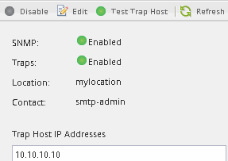

= 验证是否已启用 SNMP
:allow-uri-read: 
:icons: font
:imagesdir: ../media/

[role="lead"]
您可以在 ONTAP 9.7 或更早版本中使用 ONTAP System Manager _classic_ 界面来验证集群上是否启用了 SNMP 。

.关于此任务
在所有版本的 ONTAP 中，默认情况下会在集群级别启用 SNMPv3 ，默认情况下会禁用 SNMPv1 和 SNMPv2c 。创建 SNMP 社区时， SNMPv1 和 SNMPv2c 将处于启用状态。

默认情况下， SNMP 在数据 LIF 上处于禁用状态。有关在数据 LIF 上启用 SNMP 的信息，请参见 https://docs.netapp.com/us-en/ontap/networking/index.html["网络管理"^]。

.步骤
. 单击切槽图标。
. 在 * 设置 * 窗格中，导航到 * SNMP * 窗口。
+

+
您可以查看集群的当前 SNMP 状态。

+
如果未启用 SNMP ，请单击 * 启用 * 。

