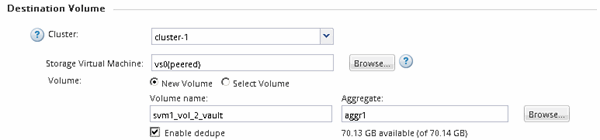

= 创建 SnapVault 关系（ ONTAP 9.2 或更早版本）
:allow-uri-read: 
:icons: font
:imagesdir: ../media/

[role="lead"]
您必须在一个集群上的源卷与对等集群上的目标卷之间创建 SnapVault 关系，才能创建 SnapVault 备份。

.开始之前
* 您必须具有目标集群的集群管理员用户名和密码。
* 目标聚合必须具有可用空间。

.关于此任务
您必须从 * 源 * 集群执行此任务。

.步骤
. 单击 * 存储 * > * SVMs * 。
. 选择 SVM ，然后单击 * SVM 设置 * 。
. 单击 * 卷 * 选项卡
. 选择要备份的卷，然后单击 * 保护 * 。
. 在 * 创建保护关系 * 对话框中，从 * 关系类型 * 下拉列表中选择 * 存储 * 。
. 在 * 目标卷 * 部分中，选择对等集群。
. 指定目标卷的 SVM ：
+
|===
| 如果 SVM 为 ... | 那么 ... 

 a| 
peered
 a| 
从列表中选择对等 SVM 。

 a| 
未建立对等关系
 a| 
.. 选择 SVM 。
.. 单击 * 身份验证 * 。
.. 输入对等集群的集群管理员凭据，然后单击 * 创建 * 。

|===
. 创建新目标卷：
+
.. 选择 * 新建卷 * 选项。
.. 使用默认卷名称或输入新卷名称。
.. 选择目标聚合。
.. 确保已选中 * 启用重复数据删除 * 复选框。

+

. 在*Configuration Details*部分中，选择 `XDPDefault` 作为保护策略。
. 从计划列表中选择一个保护计划。
. 确保选中 * 初始化关系 * 复选框以传输基本 Snapshot 副本，然后单击 * 创建 *
+
image::../media/config_details_snapvault.gif[带有初始化关系复选框的配置详细信息选项卡]

+
向导将使用指定的存储策略和计划创建关系。通过启动从源卷到目标卷的基线数据传输来初始化此关系。

+
状态部分显示每个作业的状态。

+
image::../media/create_snapvault_success.gif[创建保护关系选项卡、其中状态部分显示每个作业的状态]

. 验证SnapVault关系的关系状态是否在中 `Snapmirrored` 状态。
+
.. 从卷列表中选择卷，然后单击 * 数据保护 * 。
.. 在*数据保护*底部选项卡中，验证您创建的SnapMirror关系是否已列出，关系状态是否为 `Snapmirrored` 类型为 `Vault`。
+
image::../media/data_protection_window_sv.gif[底部的数据保护选项卡]

