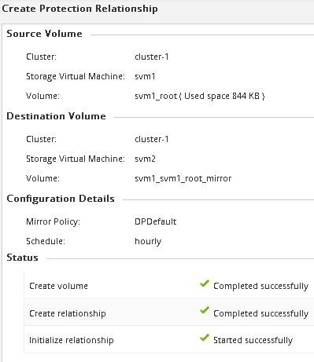

= 创建 SnapMirror 关系（ ONTAP 9.2 或更早版本）
:allow-uri-read: 
:icons: font
:imagesdir: ../media/

[role="lead"]
您必须在一个集群上的源卷与对等集群上的目标卷之间创建 SnapMirror 关系，以便复制数据以进行灾难恢复。

.开始之前
* 您必须具有目标集群的集群管理员用户名和密码。
* 目标聚合必须具有可用空间。
* 必须对这两个集群进行适当的配置和设置，以满足您的环境对用户访问，身份验证和客户端访问的要求。

.关于此任务
您必须从 * 源 * 集群执行此任务。

.步骤
. 单击 * 存储 * > * SVMs * 。
. 选择 SVM ，然后单击 * SVM 设置 * 。
. 单击 * 卷 * 选项卡
. 选择要为其创建镜像关系的卷，然后单击 * 保护 * 。
+
此时将显示创建保护关系窗口。

. 在 * 关系类型 * 部分中，从 * 关系类型 * 下拉列表中选择 * 镜像 * 。
. 在 * 目标卷 * 部分中，选择对等集群。
. 指定目标卷的 SVM ：
+
|===
| 如果 SVM 为 ... | 那么 ... 

 a| 
peered
 a| 
从列表中选择对等 SVM 。

 a| 
未建立对等关系
 a| 
.. 选择 SVM 。
.. 单击 * 身份验证 * 。
.. 输入对等集群的集群管理员凭据，然后单击 * 创建 * 。

|===
. 创建新目标卷：
+
.. 选择 * 新建卷 * 选项。
.. 使用默认卷名称或指定新卷名称。
.. 选择目标聚合。

+
image::../media/destination_volume_settings.gif[目标卷设置]

. 在 * 配置详细信息 * 部分中，选择 * 镜像 AllSnapshots* 作为镜像策略。
+
`DPDefault` 和 `MirrorLatest` 是可用于SnapMirror关系的其他默认镜像策略。

. 从计划列表中选择一个保护计划。
. 确保选中 * 初始化关系 * 复选框，然后单击 * 创建 * 。
+
初始化 SnapMirror 关系可确保目标卷具有开始保护源卷的基线。

+
image::../media/create_snapmirror_relationship_window.gif[创建SnapMirror窗口]

+
通过启动从源卷到目标卷的基线数据传输来初始化此关系。

+
初始化操作可能需要一些时间。状态部分显示每个作业的状态。

+

. 验证 SnapMirror 关系的关系状态：
+
.. 从 * 卷 * 列表中选择为其创建 SnapMirror 关系的卷，然后单击 * 数据保护 * 。
.. 在*数据保护*选项卡中，确认已列出您创建的SnapMirror关系，并且此关系的状态为 `Snapmirrored`。
+
image::../media/snapmirror_create_4_verify.gif[验证是否已创建关系]

== 下一步操作

您必须记下源卷的设置，例如精简配置，重复数据删除，数据压缩和自动增长。中断 SnapMirror 关系时，您可以使用此信息来验证目标卷设置。
