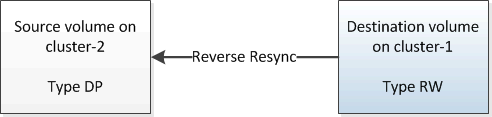

= 重新同步源卷
:allow-uri-read: 
:icons: font
:imagesdir: ../media/

[role="lead"]
当源卷联机时，您必须在目标卷和源卷之间重新同步数据，以便从目标卷复制最新数据。

.开始之前
源卷必须处于联机状态。

.关于此任务
您必须从 * 目标 * 集群执行此任务。

下图显示了将数据从活动目标卷复制到只读源卷：

.步骤
. 根据您运行的 System Manager 版本，执行以下步骤之一：
+
** ONTAP 9.4 或更早版本：单击 * 保护 * > * 关系 * 。
** 从 ONTAP 9.5 开始：单击 * 保护 * > * 卷关系 * 。

. 选择源卷和目标卷之间的 SnapMirror 关系。
. 记下为 SnapMirror 关系配置的传输计划和策略。
. 单击 * 操作 * > * 反向重新同步 * 。
. 选中确认复选框，然后单击 * 反向重新同步 * 。
+
image::../media/reverse_resync_4eea.gif[反向重新同步屏幕]

+
从ONTAP 9.3开始、此关系的SnapMirror策略将设置为 `MirrorAllSnapshots` 并且镜像计划设置为 `None`。

+
如果您运行的是ONTAP 9.2或更早版本、则此关系的SnapMirror策略将设置为 `DPDefault` 并且镜像计划设置为 `None`。

. 在源集群上，指定与原始 SnapMirror 关系的保护配置匹配的 SnapMirror 策略和计划：
+
.. 根据您运行的 System Manager 版本，执行以下步骤之一：
+
*** ONTAP 9.4 或更早版本：单击 * 保护 * > * 关系 * 。
*** 从 ONTAP 9.5 开始：单击 * 保护 * > * 卷关系 * 。

.. 选择已重新同步的源卷与目标卷之间的 SnapMirror 关系，然后单击 * 编辑 * 。
.. 选择 SnapMirror 策略和计划，然后单击 * 确定 * 。

