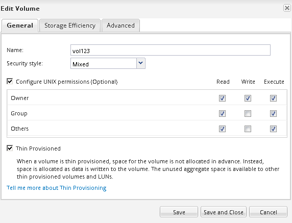

= 验证目标卷状态
:allow-uri-read: 
:icons: font
:imagesdir: ../media/

[role="lead"]
中断 SnapMirror 关系后，您必须验证目标卷是否具有读 / 写访问权限，以及目标卷设置是否与源卷的设置匹配。

.关于此任务
您必须从 * 目标 * 集群执行此任务。

.步骤
. 导航到 * 卷 * 窗口。
. 从*卷*列表中选择目标卷，然后验证目标卷类型是否为 `rw`，表示读/写访问。
. 验证目标卷上的精简配置，重复数据删除，数据压缩和自动增长等卷设置是否与源卷的设置匹配。
+
您可以使用创建 SnapMirror 关系后记下的卷设置信息来验证目标卷设置。

. 如果卷设置不匹配，请根据需要修改目标卷上的设置：
+
.. 单击 * 编辑 * 。
.. 根据需要修改环境的常规设置，存储效率设置和高级设置。
.. 单击 * 保存并关闭 * 。
+

.. 验证 * 卷 * 列表中的列是否已更新为适当的值。

. 为目标卷启用 Snapshot 副本创建。
+
.. 根据您的 ONTAP 版本，通过以下方式之一导航到 * 配置卷 Snapshot 副本 * 页面：
+
从 ONTAP 9.3 开始：选择目标卷，然后单击 * 操作 * > * 管理快照 * > * 配置 * 。

+
ONTAP 9.2 或更早版本：选择目标卷，然后单击 * Snapshot 副本 * > * 配置 * 。

.. 选中 * 启用计划的 Snapshot 副本 * 复选框，然后单击 * 确定 * 。

+
image::../media/configure_snapshot_policy.gif[配置卷 Snapshot 副本]

